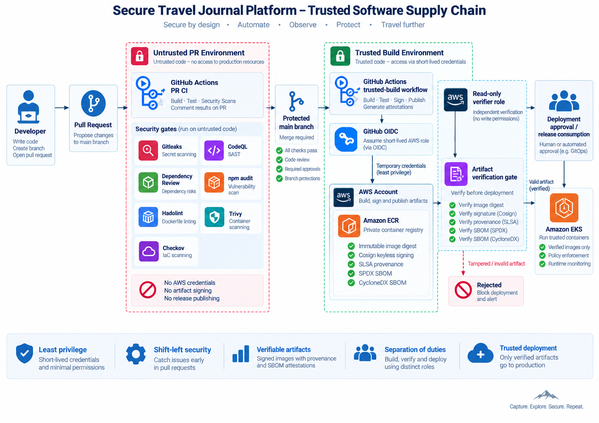
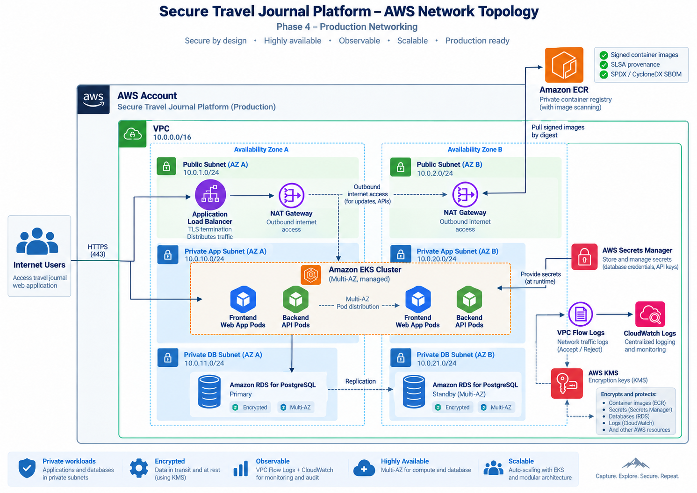
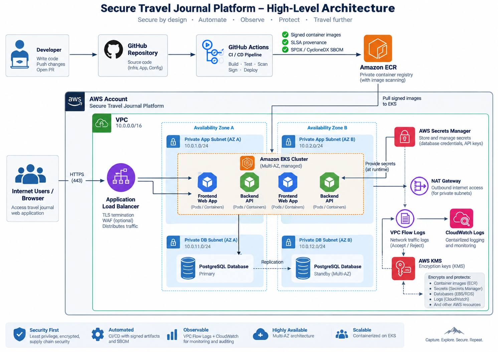

# Secure Travel Journal Platform

> A security-focused AWS platform demonstrating how application code progresses from an **untrusted pull request** through automated security controls into a **signed, attestable and independently verifiable container artifact**, before deployment to secure AWS infrastructure.

The Secure Travel Journal Platform is a hands-on **Cloud Security / DevSecOps portfolio project** built to demonstrate security engineering decisions across the software delivery lifecycle.

The project focuses on:

* secure CI/CD design;
* software supply-chain security;
* AWS identity federation and least privilege;
* container security;
* artifact signing and verification;
* SBOM and provenance generation;
* Infrastructure as Code;
* secure AWS networking;
* Kubernetes/EKS security;
* evidence-driven security validation.

The application itself is deliberately simple.

The primary objective is to demonstrate the **security architecture surrounding the application**.

---

## Architecture

### Trusted software supply chain

The implemented delivery pipeline separates **untrusted pull-request execution** from the **trusted artifact-production environment**.



The core trust model is:

```text
Developer
    |
    v
Pull Request
    |
    v
+--------------------------------+
| Untrusted PR Environment       |
|                                |
| Gitleaks                       |
| CodeQL                         |
| Dependency Review              |
| npm audit                      |
| Hadolint                       |
| Trivy                          |
| Checkov                        |
|                                |
| No AWS credentials             |
| No artifact signing            |
| No trusted publishing          |
+--------------------------------+
    |
    | all required checks pass
    v
Protected Main Branch
    |
    v
+--------------------------------+
| Trusted Build Environment      |
|                                |
| GitHub Actions                 |
|       |                        |
|       v                        |
| GitHub OIDC                    |
|       |                        |
|       v                        |
| Short-lived AWS role           |
|       |                        |
|       v                        |
| Build once                     |
| Scan                           |
| Sign                           |
| Generate provenance            |
| Generate SBOMs                 |
| Publish to ECR                 |
+--------------------------------+
    |
    v
Immutable ECR Artifact
    |
    v
Read-only Verification Role
    |
    +--> Verify digest
    +--> Verify Cosign signature
    +--> Verify SLSA provenance
    +--> Verify SPDX SBOM
    +--> Verify CycloneDX SBOM
    |
    v
Trusted Artifact
    |
    v
Deployment
```

This prevents pull-request code from crossing the production trust boundary simply because it can execute inside CI.

---

## Current Project Status

| Phase      | Capability                                          | Status         |
| ---------- | --------------------------------------------------- | -------------- |
| Phase 1    | Application baseline                                | ✅ Complete     |
| Phase 2    | Secure pull-request CI/CD pipeline                  | ✅ Complete     |
| Phase 3    | Trusted software supply chain                       | ✅ Complete     |
| Phase 4.1  | AWS infrastructure foundation / Terraform bootstrap | ✅ Complete     |
| Phase 4.2  | Secure multi-AZ AWS networking                      | 🚧 In progress |
| Phase 4.3+ | EKS, database and runtime security controls         | 📋 Planned     |

The current focus is **Phase 4: Secure AWS Infrastructure**.

---

# What This Project Demonstrates

This repository is designed around security engineering outcomes rather than simply integrating security tools.

### 1. Untrusted code is treated as untrusted

Pull requests are allowed to:

* build application code;
* execute tests;
* run static analysis;
* scan dependencies;
* scan containers;
* validate Terraform;
* perform policy checks.

Pull requests are **not** allowed to:

* obtain AWS production credentials;
* push trusted container images;
* sign release artifacts;
* create trusted attestations;
* deploy workloads.

This creates an explicit CI/CD trust boundary.

---

### 2. AWS authentication uses short-lived credentials

The trusted GitHub Actions workflow authenticates to AWS using:

```text
GitHub Actions
      |
      v
GitHub OIDC
      |
      v
AWS IAM Role
      |
      v
Temporary STS Credentials
```

Long-lived AWS access keys are not stored in GitHub.

IAM trust policies restrict which repository and workflow contexts may assume AWS roles.

---

### 3. Container artifacts are immutable

Trusted images are identified using their immutable SHA-256 digest rather than relying on mutable tags.

Example:

```text
123456789012.dkr.ecr.eu-west-2.amazonaws.com/backend@sha256:...
```

The trusted artifact is therefore bound to the exact image that was:

* built;
* scanned;
* signed;
* attested;
* verified.

---

### 4. Artifacts are cryptographically verifiable

Container images published by the trusted workflow are signed using **Cosign keyless signing**.

Verification validates the expected GitHub Actions identity and OIDC issuer.

A deployment consumer can therefore determine:

> Was this exact container produced by the trusted workflow from this repository?

rather than merely trusting that an image exists in ECR.

---

### 5. Build provenance is generated

The trusted build generates **SLSA provenance** for release artifacts.

Provenance provides evidence about:

* where an artifact came from;
* which build process produced it;
* which workflow executed the build;
* the relationship between source and resulting artifact.

This strengthens protection against software supply-chain tampering.

---

### 6. Software inventories are attached to artifacts

The pipeline generates both:

* **SPDX SBOM**
* **CycloneDX SBOM**

These provide machine-readable inventories of software components associated with the released artifact.

The SBOMs are treated as part of the artifact evidence rather than isolated CI files.

---

### 7. Build and verification duties are separated

Artifact production and artifact verification use different AWS IAM roles.

```text
Build / Publish Role
        |
        | write
        v
     Amazon ECR
        ^
        | read only
        |
Verifier Role
```

The verification role does not require container publishing permissions.

This creates a clearer separation between:

* artifact production;
* artifact storage;
* artifact verification;
* eventual deployment.

---

### 8. Negative verification is tested

The project does not only test successful verification.

Negative validation intentionally supplies an invalid expected identity and confirms that Cosign rejects the artifact.

Example failure condition:

```text
Expected:

https://github.com/INVALID-OWNER/INVALID-REPOSITORY/.*

Actual certificate identity:

https://github.com/dissacloud/Secure-Travel-Journal-Platform/...
```

The artifact is rejected because the certificate identity does not match the required trust policy.

This provides evidence that the verification control is actively enforcing identity rather than simply executing a command.

---

# Security Controls

| Security Objective                  | Implementation                         |
| ----------------------------------- | -------------------------------------- |
| Prevent committed secrets           | Gitleaks                               |
| Static application security testing | CodeQL                                 |
| Detect risky dependency changes     | GitHub Dependency Review               |
| Dependency vulnerability detection  | npm audit                              |
| Dockerfile linting                  | Hadolint                               |
| Container vulnerability scanning    | Trivy                                  |
| Terraform / IaC scanning            | Checkov                                |
| Credentialless CI authentication    | GitHub OIDC                            |
| Short-lived AWS credentials         | AWS STS                                |
| Container registry                  | Amazon ECR                             |
| Immutable artifact identity         | SHA-256 image digest                   |
| Container signing                   | Cosign                                 |
| Build provenance                    | SLSA                                   |
| Software inventory                  | SPDX SBOM                              |
| Software inventory                  | CycloneDX SBOM                         |
| Artifact verification               | Cosign + attestations                  |
| Separation of duties                | Dedicated build and verifier IAM roles |
| Infrastructure provisioning         | Terraform                              |
| Network visibility                  | VPC Flow Logs / CloudWatch             |
| Encryption                          | AWS KMS                                |
| Secret storage                      | AWS Secrets Manager                    |
| Container orchestration             | Amazon EKS — Phase 4                   |
| Database                            | Amazon RDS for PostgreSQL — Phase 4    |

---

# Phase 1 — Application Baseline

Phase 1 established a working application before security controls were introduced.

The platform contains:

* React frontend;
* Node.js backend;
* PostgreSQL database;
* Dockerized development environment.

The baseline validates application behaviour such as:

* creating journal entries;
* storing journal entries;
* retrieving persisted entries;
* deleting entries.

The application provides a realistic artifact for subsequent DevSecOps and cloud-security controls.

---

# Phase 2 — Secure Pull-Request Pipeline

Phase 2 introduced mandatory security validation before code can reach the trusted build environment.

## Pull-request security gates

```text
Pull Request
     |
     +--> Application validation
     |
     +--> Gitleaks
     |
     +--> CodeQL
     |
     +--> Dependency Review
     |
     +--> npm audit
     |
     +--> Hadolint
     |
     +--> Trivy
     |
     +--> Checkov
     |
     v
CI Gate
     |
     v
Protected Main Branch
```

A failing mandatory security control prevents the PR security gate from succeeding.

---

## Secret scanning

**Gitleaks** scans pull-request changes for exposed credentials and secrets.

The project includes controlled negative testing using a synthetic secret pattern.

The test demonstrates:

```text
Synthetic secret committed
        |
        v
Gitleaks detection
        |
        v
PR security gate fails
        |
        v
Merge blocked
```

No real credential is used during testing.

---

## Static Application Security Testing

**CodeQL** performs static analysis against application source code.

Code scanning results are surfaced through GitHub's security interface and participate in protected-branch validation.

---

## Dependency security

The project uses multiple layers of dependency validation:

* GitHub Dependency Review;
* backend `npm audit`;
* frontend `npm audit`;
* Dependabot.

Dependency vulnerabilities identified during implementation were remediated and the application dependency audits subsequently returned:

```text
0 vulnerabilities
```

---

## Container security

Container controls include:

* multi-stage Docker builds;
* non-root execution;
* Dockerfile linting with Hadolint;
* vulnerability scanning with Trivy.

Container security checks run before an artifact can progress into the trusted release path.

---

## Infrastructure-as-Code security

Terraform is scanned with **Checkov** to detect insecure infrastructure configurations before deployment.

Security exceptions must be intentional and documented rather than silently ignored.

---

# Phase 3 — Trusted Software Supply Chain

Phase 3 moves the project from:

> "CI pipeline with scanners"

to:

> "verifiable software supply chain."

A successful security scan does not automatically make an artifact trusted.

The project therefore introduces controls around **artifact identity, provenance and verification**.

---

## Trusted build workflow

Only code that reaches the protected `main` branch is permitted to enter the trusted-build workflow.

The workflow:

1. authenticates to AWS using GitHub OIDC;
2. obtains short-lived AWS credentials;
3. builds the application containers;
4. scans the container images;
5. pushes trusted artifacts to Amazon ECR;
6. records immutable digests;
7. signs artifacts using Cosign;
8. creates SLSA provenance;
9. generates SPDX SBOMs;
10. generates CycloneDX SBOMs;
11. associates supply-chain evidence with the artifact;
12. verifies the resulting artifact.

---

## Trusted artifact model

```text
Source Commit
     |
     v
Trusted GitHub Workflow
     |
     v
Container Build
     |
     v
Vulnerability Gate
     |
     v
Amazon ECR
     |
     +--> Immutable Digest
     |
     +--> Cosign Signature
     |
     +--> SLSA Provenance
     |
     +--> SPDX SBOM
     |
     +--> CycloneDX SBOM
     |
     v
Independent Verification
```

---

## Artifact verification

Artifacts are verified using their immutable ECR digest.

Verification checks include:

```text
Artifact
   |
   +--> Is the digest correct?
   |
   +--> Is the Cosign signature valid?
   |
   +--> Was it produced by the expected GitHub identity?
   |
   +--> Is the SLSA provenance valid?
   |
   +--> Is the SPDX SBOM available?
   |
   +--> Is the CycloneDX SBOM available?
   |
   v
Trusted / Rejected
```

The verifier is intentionally separate from the build/push role.

---

# Phase 3 Evidence

The project captures implementation evidence rather than relying only on architecture documentation.

Key evidence includes:

| Evidence                                   | Demonstrates                                |
| ------------------------------------------ | ------------------------------------------- |
| `01-phase-3-trusted-build-green.png`       | Successful trusted-build workflow           |
| `02-ecr-backend-digest.png`                | Immutable backend ECR digest                |
| `03-ecr-frontend-digest.png`               | Immutable frontend ECR digest               |
| `04-sbom-artifacts.png`                    | Generated software bills of materials       |
| `05-slsa-provenance.png`                   | SLSA provenance                             |
| `06-cosign-signatures.png`                 | Cryptographic artifact signatures           |
| `07-ecr-referrers.png`                     | Supply-chain objects associated with digest |
| `08-verification-gate.png`                 | Successful artifact verification            |
| `09-negative-verification-rejected.png`    | Invalid identity/artifact rejection         |
| `10-phase-3-supply-chain-gate.png`         | End-to-end trust gate                       |
| `11-build-and-verifier-iam-separation.png` | IAM separation of duties                    |
| `12-trusted-build-summary.png`             | Trusted-build implementation summary        |

Full evidence is maintained under:

```text
docs/evidence/
```

---

# Phase 4 — Secure AWS Infrastructure

Phase 4 extends the trusted software-supply-chain work into the runtime AWS environment.

The goal is to ensure that the infrastructure consuming trusted artifacts applies the same principles:

* least privilege;
* private-by-default networking;
* encryption;
* observability;
* controlled ingress;
* restricted egress;
* workload isolation;
* reproducible infrastructure.

---

## Target AWS Architecture

> The following diagram represents the Phase 4 target runtime architecture.
> Phase 4 is currently under implementation.



The target architecture includes:

```text
Internet
   |
   v
Application Load Balancer
   |
   v
+------------------------------------------------------+
| AWS VPC                                              |
|                                                      |
|   Availability Zone A      Availability Zone B       |
|                                                      |
|   Public Subnet            Public Subnet             |
|        |                        |                    |
|      NAT                      NAT                    |
|                                                      |
|   Private App Subnet       Private App Subnet        |
|        |                        |                    |
|        +------ Amazon EKS -----+                    |
|                |                                     |
|       Frontend + Backend API                         |
|                |                                     |
|   Isolated DB Subnet       Isolated DB Subnet        |
|                |                                     |
|        Amazon RDS PostgreSQL                         |
|                                                      |
+------------------------------------------------------+
```

Supporting services include:

* Amazon ECR;
* AWS Secrets Manager;
* AWS KMS;
* Amazon CloudWatch;
* VPC Flow Logs.

---

## Phase 4.1 — Terraform Foundation

AWS infrastructure is managed using Terraform so environments can be created and destroyed reproducibly.

Terraform state is separated from the workload infrastructure and protected as infrastructure control-plane data.

The IaC is validated through:

```bash
terraform fmt
terraform validate
terraform plan
checkov --directory . --framework terraform
```

The project intentionally treats Infrastructure as Code as security-sensitive source code.

---

## Phase 4.2 — Secure Networking

Phase 4.2 establishes the network foundation for the runtime platform.

The design uses:

* dedicated VPC;
* multiple Availability Zones;
* public ingress subnets;
* private application subnets;
* isolated database subnets;
* controlled internet egress;
* VPC Flow Logs;
* CloudWatch logging;
* KMS-backed encryption where applicable.

### Network trust zones

```text
Internet
   |
   v
+-----------------------------+
| Public Tier                 |
|                             |
| Load Balancer               |
| NAT / controlled egress     |
+-----------------------------+
             |
             v
+-----------------------------+
| Private Application Tier    |
|                             |
| EKS workloads               |
| No direct public exposure   |
+-----------------------------+
             |
             v
+-----------------------------+
| Isolated Database Tier      |
|                             |
| PostgreSQL / RDS            |
| No direct internet route    |
+-----------------------------+
```

The network is designed so application workloads and databases do not require direct public exposure.

---

# Phase 4 Roadmap

The remaining runtime work is expected to introduce controls including:

### Amazon EKS

Planned controls include:

* private worker workloads;
* multi-AZ scheduling;
* controlled security groups;
* workload IAM;
* least-privilege access;
* immutable ECR digest consumption;
* runtime security validation.

### Amazon RDS for PostgreSQL

Planned controls include:

* private DB subnet group;
* encrypted storage;
* restrictive security groups;
* credential storage in Secrets Manager;
* backup and recovery configuration;
* multi-AZ design where appropriate.

### Application ingress

Planned ingress controls include:

* Application Load Balancer;
* HTTPS;
* controlled security groups;
* TLS termination;
* optional AWS WAF integration.

### Observability

Runtime visibility will include:

* VPC Flow Logs;
* CloudWatch Logs;
* EKS telemetry;
* security-relevant event logging.

---

# High-Level Architecture



The final platform combines two separate security concerns:

```text
SOFTWARE SUPPLY CHAIN SECURITY
              +
      CLOUD RUNTIME SECURITY
              |
              v
     TRUSTED APPLICATION
```

A securely configured Kubernetes cluster should not deploy an untrusted artifact.

Likewise, a cryptographically trusted artifact should not be deployed into insecure infrastructure.

This project addresses both sides of that boundary.

---

# Repository Structure

```text
Secure-Travel-Journal-Platform/
│
├── backend/
│   └── Backend application
│
├── frontend/
│   └── Frontend application
│
├── infrastructure/
│   ├── bootstrap/
│   │   └── Terraform state infrastructure
│   │
│   └── terraform/
│       └── AWS infrastructure
│
├── .github/
│   ├── workflows/
│   │   ├── pr-ci.yml
│   │   └── trusted-build.yml
│   │
│   └── dependabot.yml
│
├── docs/
│   ├── architecture/
│   │   ├── diagrams/
│   │   └── trusted-software-supply-chain.md
│   │
│   ├── evidence/
│   │   ├── phase-1/
│   │   ├── phase-2/
│   │   ├── phase-3/
│   │   └── phase-4/
│   │
│   └── runbooks/
│
├── docker-compose.yml
│
└── README.md
```

---

# Technology Stack

### Cloud

* Amazon Web Services
* Amazon ECR
* Amazon EKS
* Amazon RDS
* AWS IAM
* AWS STS
* AWS Secrets Manager
* AWS KMS
* Amazon CloudWatch
* Amazon VPC

### Infrastructure

* Terraform
* Checkov

### Containers

* Docker
* Docker Compose
* Trivy
* Hadolint

### CI/CD

* GitHub Actions
* GitHub OIDC
* GitHub Branch Protection
* GitHub Dependency Review
* Dependabot

### Application Security

* Gitleaks
* CodeQL
* npm audit

### Supply Chain Security

* Cosign
* SLSA provenance
* SPDX
* CycloneDX
* OCI attestations
* immutable image digests

### Runtime Platform

* Kubernetes
* Amazon EKS

### Application

* React
* Node.js
* PostgreSQL

---

# Security Principles

The architecture is guided by several principles.

## Least privilege

Access is scoped to the minimum required permissions.

Build, verification and eventual deployment responsibilities are separated where practical.

---

## Short-lived credentials

CI/CD authenticates to AWS using federated identity rather than stored long-lived cloud credentials.

---

## Private by default

Application and database workloads are designed to operate without direct public exposure.

---

## Verify before trust

Artifacts are not trusted simply because they exist in the organization's registry.

Their:

* digest;
* signer identity;
* provenance;
* software inventory

must be validated.

---

## Build once

A trusted artifact should be promoted by digest rather than rebuilt separately for each environment.

Rebuilding can produce a different artifact and weaken provenance guarantees.

---

## Security as code

Security controls are implemented in:

* CI/CD workflows;
* IAM policies;
* Terraform;
* container configuration;
* verification policy;
* branch protection.

This allows controls to be versioned, reviewed and reproduced.

---

## Evidence-driven validation

Security implementation is accompanied by evidence proving that controls work.

Where practical, both positive and negative tests are captured.

---

# Threats Addressed

The project is designed to reduce risks such as:

| Threat                                 | Control                              |
| -------------------------------------- | ------------------------------------ |
| Secret committed to repository         | Gitleaks                             |
| Vulnerable source code                 | CodeQL                               |
| Risky dependency introduced            | Dependency Review                    |
| Known package vulnerability            | npm audit                            |
| Vulnerable container                   | Trivy                                |
| Insecure Docker configuration          | Hadolint                             |
| Insecure Terraform configuration       | Checkov                              |
| Long-lived AWS credentials leaked      | GitHub OIDC                          |
| Untrusted PR accesses AWS              | Trust-boundary separation            |
| Artifact replaced after scanning       | Digest-based identity                |
| Malicious or unknown artifact producer | Cosign identity verification         |
| Build provenance unknown               | SLSA                                 |
| Software contents unknown              | SPDX / CycloneDX SBOM                |
| Build role verifies its own output     | Independent verifier role            |
| Tampered artifact promoted             | Verification gate                    |
| Publicly exposed workload              | Private subnets / controlled ingress |
| Unmonitored network activity           | VPC Flow Logs                        |

---

# Design Decisions

## Why separate PR CI from the trusted build?

Pull requests contain code that has not yet been approved.

Giving pull-request workflows production AWS credentials would allow untrusted code to attempt to cross the cloud trust boundary.

The project therefore separates:

```text
UNTRUSTED COMPUTE
Pull Request CI

from

TRUSTED COMPUTE
Protected Main Branch Build
```

---

## Why use GitHub OIDC?

OIDC removes the need to store persistent AWS access keys inside GitHub.

The workflow exchanges GitHub identity for short-lived AWS STS credentials.

This reduces:

* credential lifetime;
* secret-management overhead;
* impact of credential disclosure.

---

## Why use immutable ECR digests?

Tags such as:

```text
latest
production
v1
```

can move.

A SHA-256 digest identifies a specific artifact.

Verification and deployment therefore use:

```text
repository@sha256:<digest>
```

where possible.

---

## Why both SPDX and CycloneDX?

Both are widely used SBOM standards.

Generating both demonstrates the ability to produce interoperable software inventory data for different downstream security tooling and governance requirements.

---

## Why separate the verifier role?

The build role requires permissions to publish artifacts.

The verifier only needs to inspect them.

Using separate identities reduces unnecessary privilege and creates a clearer security boundary between:

```text
produce

and

trust
```

---

# Cost Management

The AWS runtime environment is a portfolio environment rather than an always-on production service.

Infrastructure is therefore designed to be reproducible through Terraform.

The expected workflow is:

```text
terraform apply
      |
      v
Deploy
      |
      v
Validate
      |
      v
Capture evidence
      |
      v
terraform destroy
```

This allows production-style AWS architecture to be demonstrated without leaving expensive resources running continuously.

---

# Running the Application Locally

Clone the repository:

```bash
git clone https://github.com/dissacloud/Secure-Travel-Journal-Platform.git
cd Secure-Travel-Journal-Platform
```

Start the development environment:

```bash
docker compose up --build
```

The local environment starts the:

* frontend;
* backend;
* PostgreSQL database.

Stop the environment with:

```bash
docker compose down
```

---

# Infrastructure Validation

Before applying Terraform changes:

```bash
terraform fmt -check
terraform validate
terraform plan
```

Run Checkov:

```bash
checkov \
  --directory . \
  --framework terraform
```

Infrastructure must pass required validation before deployment.

---

# Evidence and Documentation

The repository contains supporting evidence and technical documentation under:

```text
docs/
```

Important documentation includes:

```text
docs/
├── architecture/
├── evidence/
└── runbooks/
```

The objective is to demonstrate not only:

> what was configured

but also:

> how the control was validated.

---

# Key Security Outcomes

At the current stage, the project demonstrates:

* separation of untrusted and trusted CI environments;
* mandatory pull-request security gates;
* secret scanning;
* static application security testing;
* dependency vulnerability management;
* container scanning;
* IaC scanning;
* protected branch controls;
* AWS authentication using GitHub OIDC;
* short-lived AWS credentials;
* immutable ECR artifact identities;
* Cosign keyless signing;
* SLSA provenance;
* SPDX SBOM generation;
* CycloneDX SBOM generation;
* independent artifact verification;
* IAM separation between build and verification;
* negative-path verification testing;
* Terraform-managed AWS infrastructure;
* secure multi-AZ networking design under implementation.

---

# Project Direction

The remaining implementation will connect the trusted software supply chain to the AWS runtime environment:

```text
Secure Pull Request
        |
        v
Trusted Build
        |
        v
Signed + Attested Artifact
        |
        v
Independent Verification
        |
        v
Amazon ECR
        |
        v
Secure AWS Runtime
        |
        v
Amazon EKS
        |
        v
Application
        |
        v
Amazon RDS
```

The finished project is intended to demonstrate the responsibilities expected of a **Cloud Security / DevSecOps Engineer** rather than only application development.

---

## Repository

**GitHub:**
`dissacloud/Secure-Travel-Journal-Platform`

---

## Author

Built as a hands-on Cloud Security and DevSecOps engineering project focused on:

**AWS · Security Engineering · DevSecOps · IAM · Kubernetes · Terraform · Software Supply Chain Security**
