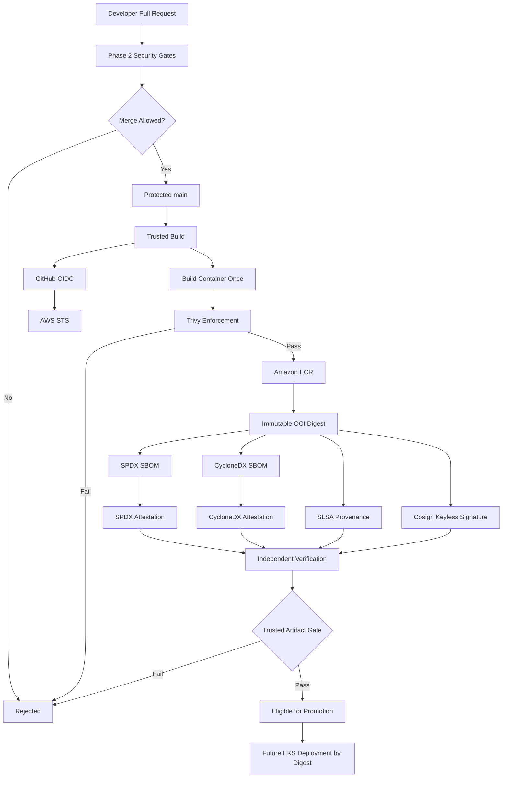

# Trusted Software Supply Chain Architecture

## Objective

The Secure Travel Journal Platform implements a trusted container
software-supply-chain that separates untrusted pull-request validation
from trusted artifact production and verification.

## Trust boundaries

### Pull-request environment

Pull requests are treated as untrusted.

They may:

- compile and test application code;
- run security scanners;
- build temporary containers;
- execute static policy checks.

They may not:

- obtain AWS identity;
- publish trusted artifacts;
- sign container images;
- generate release attestations;
- deploy workloads.

### Trusted main-branch build

Only code merged to the protected main branch may enter the trusted-build
workflow.

The workflow obtains short-lived AWS credentials using GitHub OIDC.

Long-lived AWS access keys are not stored in GitHub.

## Trusted artifact production

Each backend and frontend container is:

1. built once;
2. vulnerability scanned;
3. blocked on critical and fixable-high vulnerabilities;
4. published to an immutable Amazon ECR repository;
5. resolved to its authoritative OCI SHA-256 digest.

The deployment identity is the image digest rather than a mutable tag.

## SBOM

Syft generates:

- SPDX JSON;
- CycloneDX JSON.

SBOM generation targets the exact ECR artifact using its OCI digest.

## Provenance

GitHub Actions generates signed SLSA provenance for the immutable image.

The provenance records the build and source context associated with the
artifact.

## SBOM attestations

The SPDX and CycloneDX SBOMs are cryptographically attested against the
same OCI image digest.

## Artifact signing

Images are signed using Cosign keyless signing.

GitHub Actions OIDC establishes the workload identity used by Sigstore.

No persistent image-signing private key is maintained.

## Independent verification

Artifact verification uses a separate read-only AWS role.

Verification requires:

- correct OCI digest;
- valid Cosign signature;
- expected GitHub Actions OIDC issuer;
- expected repository;
- trusted-build workflow;
- protected main branch;
- expected source commit;
- valid SLSA provenance;
- valid SPDX attestation;
- valid CycloneDX attestation.

## Fail-closed behaviour

A valid artifact is rejected if its verified identity or provenance does
not match the expected source context.

A controlled negative test intentionally supplies an incorrect source
commit and confirms verification fails.

## Deployment eligibility

An artifact is eligible for promotion only after the Trusted Artifact
Gate passes.

Future deployment stages consume the existing approved ECR digest.

They must not rebuild the application artifact.

## Supply-chain flow

